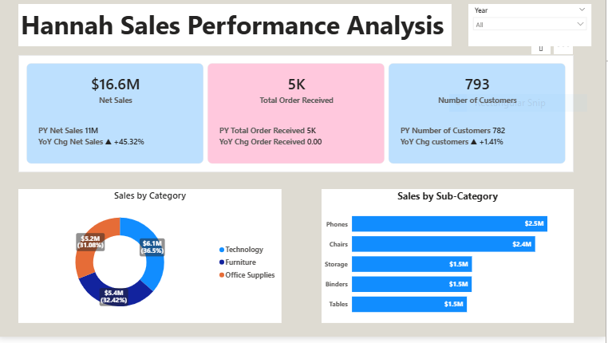
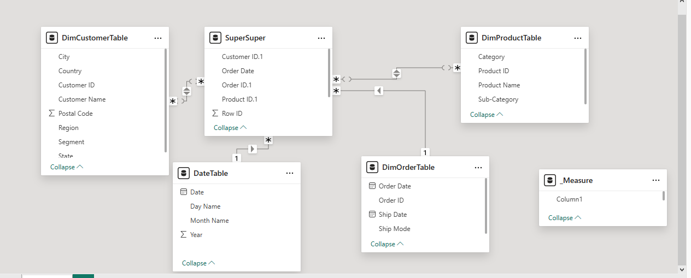

# Hannah_Sales_Performance_Analysis

## The analysis is strategically designed to support management decision-making by presenting clear, actionable KPI cards alongside relevant and insightful visuals that highlight performance trends and business opportunities.

## Executive Summary
- Management requires a comprehensive, data-driven analysis of the company’s end-to-end operations across all business units to enable informed decision-making, performance tracking, and strategic alignment.
- Management is keen to understand the level of patronage the business enjoys, with a particular focus on identifying truly loyal customers and measuring customer retention across the organization.
- Therefore, I developed an interactive Power BI dashboard that consolidates all the critical KPIs and insightful visuals required to provide a clear, data-driven view of business performance.
## The Business Problem
Hannah requires a robust, data-driven solution to holistically evaluate business performance across the value chain—covering net sales, order received, and brand sales performance, while analyzing consumer response to brands over time.
### Key Questions Addressed:
- How have Key Performance Indicators (KPIs) changed YoY?
- Which product categories and regions are lagging?
- Sub-categories that attracted the most sales.
## The Process ( Methodology)
### Tool Used : 
Power BI, Power Query, DAX
###  Data Sourcing & Overview
Using Power Query, the raw data was transformed to ensure accuracy:
- Removed duplicate entries from the dataset.
- Created a date table.
- Removed all the nulls.
- Created multiple Dimension tables.
- Extracted fact table.
- Developed a proper data model for ease of navigation and slicing.

## Analysis & Insights
This section breaks down the data into actionable stories.
### Analysis of  KPI cards
- At the end of the period under review, the business recorded net sales of $16.6M, reflecting a +45.32% year-over-year growth, compared to $11M generated in the previous year.
- The business received a total of 5,000 orders during the period under review, with order volume remaining consistent year over year.
- The total customer count stands at 793, representing a 1.41% increase compared to the previous year.
### Analysis of sales category
 The business operates across three core product categories: Technology, Furniture, and Office Supplies. Among them, Technology generated the highest sales, contributing $6.1M (36.5%), followed by Furniture with $5.4M (32.42%), while Office Supplies ranked third, contributing $5.2M (31.08%) of total revenue.
### Analysis of Sales by sub-category
Across all subcategories, the top-performing segments are Phones, Chairs, and Storage, contributing $2.5M, $2.4M, and $1.5M respectively.
From 2015 to 2018, Phones consistently maintained the leading position among all subcategories, while the remaining segments competed for the second and third spots.
### Customers Loyalty
The business’s top five customers are Greg Tran, Ken Lansdale, Sanjit Engle, Andrian Barton, and Clay Ludtke.
##  Recommendation
- Leverage Top-Performing Categories : Focus on Technology, particularly Phones, to drive further growth through expanded offerings, targeted promotions, and product bundling.
- Enhance Customer Loyalty : Implement personalized loyalty programs for top customers to strengthen retention and encourage repeat purchases, supporting continued revenue growth.
- Increase Order Volume : Develop strategies to boost order frequency and attract new customers, addressing the flat total order trend of 5,000 per period.
- Optimize Underperforming Segments : Review Furniture and Office Supplies for pricing, inventory, and promotional opportunities to improve their contribution to overall sales.
- Data-Driven Decision Making : Continue leveraging the Power BI dashboard to monitor KPIs in real time, enabling proactive operational and strategic decisions.
- Explore Market Expansion : Assess opportunities in new geographies or customer segments to diversify revenue streams and capitalize on growth potential.

 [Interactive Power BI Link](https://app.powerbi.com/view?r=eyJrIjoiZmIyMGNhNDUtOThjMS00ZGQ1LWFkYTktYjQwYjczOTVhYWEwIiwidCI6IjY0M2NkODIwLWU2YzYtNGI2ZC05ZDc5LTJjOTgwOTllMTg3MCJ9)

  

